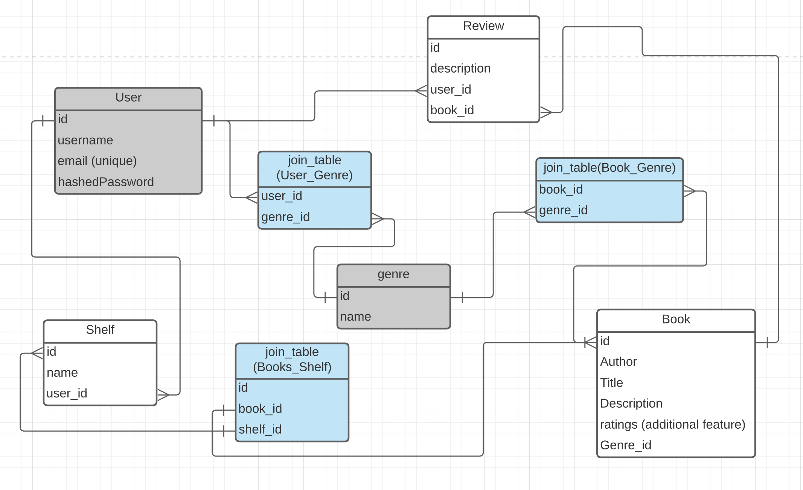

[Live Link](https://aa-badreads.herokuapp.com/)


<div align="center">
  <h2>Table of Contents</h2>
</div>

- [Technologies](#technologies)
- [Model Schema](#Model-Schema)
- [Installation](#Installation)
- [Features](#features)
- [Contributing](#contributing)
- [Team](#team)
- [Todo](#Todo)

## Technologies
- Back End
  - Express
- Front End
  - Pug


## Model Schema


## Installation
1. Clone this repository

    ```bash
    git clone`https://github.com/tjtaylorjr/goodreads-clone.git`
    ```

2. Install dependencies

    ```bash
    $ npm install
    ```
3. Create user and database (PSQL)

    ```
    - CREATE USER badreads_app WITH PASSWORD <<good password>>
    - CREATE DATABASE badreads WITH OWNER badreads_app
    ```
    
4. Create .env and add configuration modeled below:

    ```
    PORT=8080
    DB_USERNAME=badreads_app
    DB_PASSWORD=<<your good password>>
    DB_DATABASE=badreads
    DB_HOST=localhost
    JWT_SECRET=db848d54f348cf7e9606293213f1169870c2f2268217ba093f1d0049e9928117
    JWT_EXPIRES_IN=604800 (**about a week**)
    ```

5. Start it up

    ```bash
    $ npm start
    ```
  
<br>

> browse to http://localhost:8080
---

## Features

### Create/Delete Bookshelves
***
An event is registered when a user clicks the `add` bookshelf button. The name of the custom bookshelf is collected in the `formData` object and sent in the body of the post request to `/api-user/shelves`. The `overlay` div is displayed upon a set timeout of 3 seconds accompanied by a smooth transition duration for a better user visual experience. 

```js
// get-bookshelf-list.js

  addBookshelfButton.addEventListener("click", openCreateNewBookshelfField);

    newBookshelfForm.addEventListener('submit', async e => {
        e.preventDefault();
        const formData = new FormData(newBookshelfForm);
        const newBookshelfName = formData.get('newBookshelfName');

        const body = {newBookshelfName}

        const res = await fetch('/api-user/shelves', {
            method: "POST",
            body: JSON.stringify(body),
            headers: {
                Authorization: `Bearer ${localStorage.getItem(
                    "BADREADS_ACCESS_TOKEN"
                )}`,
                "Content-Type": "application/json"
            }
        });

        //return newly created bookshelf
        const data = await res.json();
        const { bookshelf } = data;

        appendBookshelfLi(bookshelf);

        const overlay = document.querySelector('.overlay');
        overlay.classList.remove('overlay-hidden');
        overlay.innerHTML = `'${newBookshelfName}' added to your shelves!`
        newBookshelfFormField.classList.add('hidden');
        addBookshelfButton.classList.remove('hidden');

        setTimeout(() => {
            overlay.classList.add('overlay-hidden');
        }, 3000)
    });
```
The shelf is then deleted by clicking the `x` button next to the name of the shelf on the `/user/shelves` page and sending a `DELETE` req to `/api-user/shelves/${shelfId}`. The `shelfId` is populated from the id associated with the bookshelf title through the `event.target` object.

```js
// delete-shelf.js

try {
      const res = await fetch(`/api-user/shelves/${shelfId}`, {
        method: "DELETE",
        headers: {
          Authorization: `Bearer ${localStorage.getItem(
              "BADREADS_ACCESS_TOKEN"
          )}`,
        }
      });

```

### Add Books to Custom Bookshelf
***
Books can be added to bookshelves two ways: the dropdown from `/user/shelves` page where the bookshelves are located, or the books details page (`/books/:bookId`) after searching for a particular book. It's important to highlight that books can not appear multiple times on the same bookshelf. This is ensured by doing a query in the Back End `/api-user/excluded-shelves/books/:bookid` route for the bookshelf dropdown select field that filters out bookshelves the books already belongs to. 

```js
// api-user.js file

//code grabs all shelves for user with book and all shelves in db then filters out all shelves by excluding
//the shelves found for the user with the book

    const bookId = req.params.bookid;
    //all shelves for the user that have the specified book
    const shelves = await Shelf.findAll({
      where: {
        user_id: req.user.id,
      },
      include: {
        model: Book, where: {
          id: bookId
        }
      }
    });

    //all shelves in db for the user
    const allShelves = await Shelf.findAll({
      where: {
        user_id: req.user.id
      }
    });

    //shelf id's for all user shelves with specific book
    let includedShelf = [];
    for (let shelf of shelves) {
      includedShelf.push(shelf.id);
    };
    //array of all shelves in db
    let allShelvesArray = [];
    for (let shelf of allShelves) {
      allShelvesArray.push(shelf);
    };

    //filters array for all shelves in db to have all shelves that don't contain the book already
    const allShelvesWithoutBook = allShelvesArray.filter(function (shelf) {
      if (!includedShelf.includes(shelf.id)) {
        return shelf;
      }
    });
    //return as an obj containing the filtered array of objects
    res.json({ allShelvesWithoutBook });
```
Note: 
  - All the shelves for the user are found first. Then the list of shelves with the book included. That list is then converted to id's which is easier to manage later opposed to the shelf object from the db. The array of id's are then used to filter out all of the bookshelves that include that id by cross referencing them with the original query of all the user bookshelves. 

### Search Feature
***
The Front End `/books` route handles the search feature. The navbar encompases the form: 

```pug
  //- navbar.pug file

form(action="/books" method="GET" class='navbar__search')
  input(type="search" name="term" placeholder="Search By Title/Author" class="input-field navbar__search-field")
  button(type="submit" class="button-dark") discover
```

The API to route `/books`, which accepts a `GET` req with the search term interpolated in the url, gets extracted. The search term is then use to query all book resources in the db that house the search term in it's title, case insensitive ofcourse. 

```js
router.get('/', asyncHandler(async (req, res) => {
  const { term } = req.query;
  let books;
  if (term) {
    try {
      books = await Book.findAll({
        where: {
          [Op.or]: [
            { title: { [Op.iLike]: `%${term}%` } },
            { author: { [Op.iLike]: `%${term}%` } }
          ]
        },
        order: [['title', 'ASC']]
      });
    } catch (err) {
      console.log(err);
    }
  } else {
    books = await Book.findAll({
      limit: 30,
      order: [['title', 'ASC']]
    })
  }
  const searchTitle = `Search result for "${term}"`
  res.render('searchpage', { books, searchTitle });

}))
```
Note: 
  - The conditional logic for the search term also returns all books in the db if no search term is entered in the form when the user presses enter. 

### Add Reviews to Books
***
The reviews feature was another challenging feature to implement on it's own by utilizing AJAX to get the review to be added to the page without a page refresh in vanilla js.

The pug file renders all the reviews upon page load, but the added review is added to the DOM by prepending it to the unordered list of reviews:

```pug
  //- bookpage.pug file

  div.container__all-reviews
    each review in book.Reviews
        div(class='container__reviews')
            //- length is checked for ellipses purposes 
            if review.description.length > 260 
                div(class='container__reviews___star')
                        p(class='container__reviews__text') #{review.description.slice(0, 250)}
                            span(class='ellipses') ...
                            span(class='readmore-text hide') #{review.description.slice(250)}
                div(class='container__reviews__text')
                    p(class='container__reviews__readmore') readmore
            else 
                div(class='container__reviews___star')
                    p(class='container__reviews__text') #{review.description}
```
```js

// book-show.js file

const addNewReview = (review) => {
    const reviewContainer = document.createElement('div')
    reviewContainer.classList.add('container__reviews')

    let newReview;
    // to add ellipses for reviews that are over 250 characters in length
    if (review.length > 260) {
        newReview = `
                        <div class='container__reviews___star'>
                            <p class='container__reviews__text'>
                                    ${review.slice(0, 250)}
                                    <span class='ellipses'>...</span>
                                    <span class='readmore-text hide'>${review.slice(250)}</span>
                            </p>
                        </div>
                        <div class='container__reviews__text'>
                            <p class='container__reviews__readmore'>
                                    readmore
                            <p/>
                        </div>
                    `
        reviewContainer.innerHTML = newReview
        allReviewsContainer.prepend(reviewContainer)

        //add readmore button event listener when review added
        //had to add seperately since page doesn't refresh when review is added and the event listener doesn't
        //get add until the page is refreshed reflected by code at line 166
        const newReviewReadmoreButton = document.querySelector('.container__reviews__readmore')
        const newReviewReadmoreText = document.querySelector('.readmore-text')
        const newReviewEllipses = document.querySelector('.ellipses')
        newReviewReadmoreButton.addEventListener('click', (e) => {
            if (newReviewReadmoreText.classList.contains('hide')) {
                //reveal hidden text
                newReviewReadmoreText.classList.toggle('hide', false)
                //change reamdmore button to readless
                newReviewReadmoreButton.innerHTML = 'readless'
                //hide the ellipses
                newReviewEllipses.classList.toggle('hide', true)
            } else {
                //hide the text
                newReviewReadmoreText.classList.toggle('hide', true)
                //change button back to readmore
                newReviewReadmoreButton.innerHTML = 'readmore'
                //reveal the ellipses
                newReviewEllipses.classList.toggle('hide', false)
            }
        })

    } else {
        newReview = `
                        <div class='container__reviews___star'>
                            <p class='container__reviews__text'>
                                    ${review}
                            </p>
                        </div>
                    `
        reviewContainer.innerHTML = newReview
        allReviewsContainer.prepend(reviewContainer)
    }
}

```
Note: 
  - Duplicates are avoided by clearing out the reviews upon page refresh and upon entering of the newly created review. 

  - The reviews also have a `readmore` / `readless` ellipses button that gets added to the DOM if the review is longer than 250 characters utlizing the `slice` method. When the `readmore` button is clicked, the rest of the sliced review is displayed. If the `readless` button is clicked, the rest of the slice review is hidden and the ellipses (`...`) is appended. 


## Contributing

> To get started...

### Step 1

- **Option 1**
    - 🍴 Fork this repo!

- **Option 2**
    - 👯 Clone this repo to your local machine using `https://github.com/tjtaylorjr/goodreads-clone.git`

### Step 2

- **HACK AWAY!** 🔨🔨🔨

### Step 3

- 🔃 Create a new pull request using <a href="https://github.com/tjtaylorjr/goodreads-clone/compare" target="_blank">`https://github.com/tjtaylorjr/goodreads-clone/compare`</a>.

---

## Team


| <a href="https://github.com/qsmity" target="_blank">**Quynn Smith**</a> | <a href="https://github.com/remaley5" target="_blank">**remaley5**</a> | <a href="https://github.com/tjtaylorjr" target="_blank">**TJ Taylor**</a> | <a href="https://github.com/xxl4tomxu98" target="_blank">**Tom Xu**</a> |
|:---:|:---:|:---:|:---:|
| [](https://github.com/qsmity) | <a href="https://avatars0.githubusercontent.com/u/16943507?s=200&v=4" target="_blank"></a> | [](https://github.com/tjtaylorjr) | [](https://github.com/xxl4tomxu98) |
| <a href="http://github.com/qsmity" target="_blank">`github.com/qsmity`</a> | <a href="https://github.com/remaley5" target="_blank">`github.com/remaley5`</a> | <a href="http://github.com/tjtaylorjr" target="_blank">`github.com/tjtaylorjr`</a> | <a href="http://github.com/xxl4tomxu98" target="_blank">`github.com/xxl4tomxu98`</a> |


## Todo

- [x] about page
- [ ] add photos to cloud storage (aws)
- [ ] pagination for search results
- [ ] upload profile photo using cloud storage (aws)
- [ ] change password or email in profile
