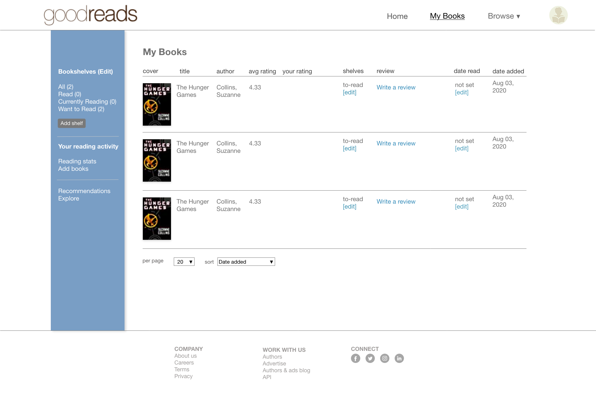
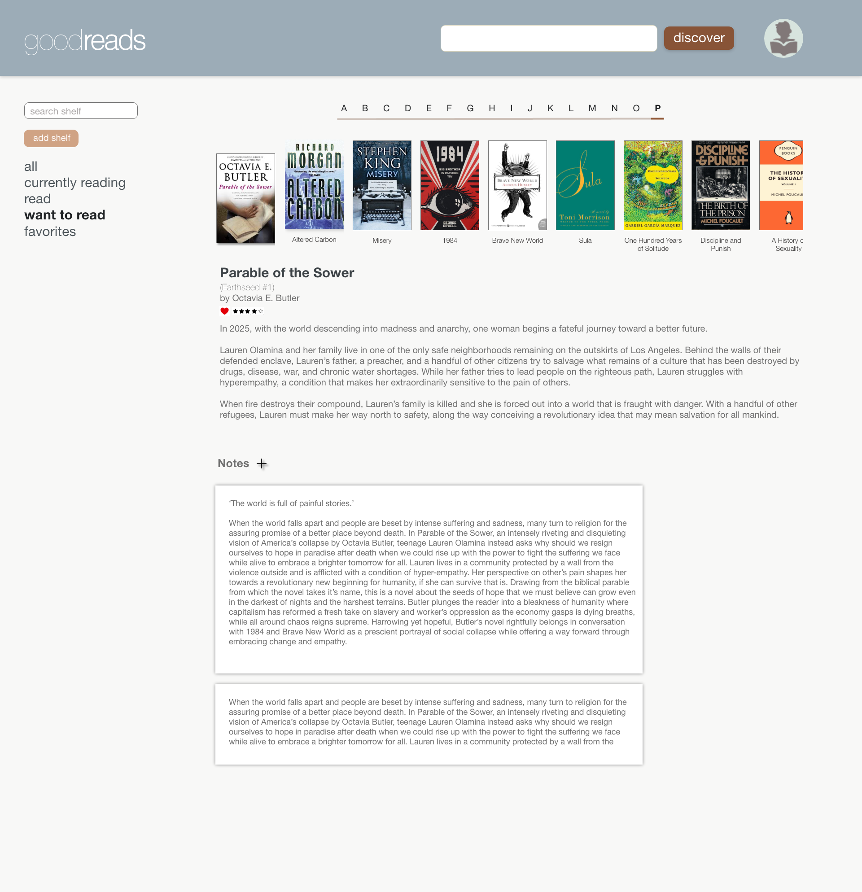

# BOOKSHELF FEATURE PACKET

### User Story
---

As a user that wants to record my reading history,
 
I want to be able to create bookshelves based on specific criteria
 
So that I can easily see and categorize what I have read before.

scroll through bookself
dropdown info bar
book notes
delete a bookshelf
delete a book from a bookshelf
move or copy over a book to a different bookshelf
book status

### Models
---
> dependent on
- User
  - username
  - email
  - hashedPassword

> to be built
- Shelf
  - shelfName

### Endpoints
---

/bookshelf
 
/bookshelf/:shelf_id
 

### Templates
---

bookshelf.pug (include sidebar)
shelf.pug
bookprofile.pug

### Sketches

---

---
